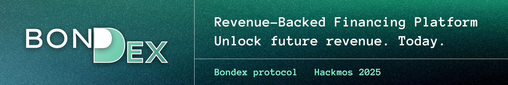

# HACKMOS-2025

`Bondex` — Revenue-Backed Financing Platform. Unlock future revenue — get your overdraft today!

Today, Web3 teams can’t easily access financing: lenders demand liquid collateral, which limits growth.

Bondex solves this by transforming stable, predictable cash flows — such as salaries from DAO treasuries, Continuous Funds, or recurring payments from business contracts — into tradable bonds.

Investors gain low-risk opportunities and a secondary market, while teams unlock instant, collateral-free capital.

We provide on-chain and DAO-native compliance, ensuring that all funding operations align seamlessly with decentralized governance principles.

**_Bondex introduces a new asset class: Revenue-Backed Bonds.
The future of financing — accessible today._**

Let’s move on to the problem we’re addressing!

## Content
* [Content](#Content)
* [Problem](#Problem)
* [Possible solutions](#Possible)
* [Our solution — On-Chain Data Hub](#Our)
* [Architecture](#Architecture)
* [Demo](#Demo)
* [Use cases](#Use)
* [Repositories](#Repositories)

## Problem

#### Todo
**1️⃣ Over-Collateralization Is the Only Option**
Current lending protocols require borrowers to lock more value than they borrow.
Even if your future revenue is guaranteed, you still need liquid collateral today.

_→ Capital-inefficient and excludes most real-world participants._

**2️⃣ Lack of Native, Non-Liquid Collateral**
Crypto doesn’t yet recognize cash flow as collateral.
Protocols only accept liquid tokens — ignoring predictable, recurring income like payroll streams, DAO budgets, or service contracts.

_→ Stable revenue remains untapped and unusable._

**3️⃣ No Mechanism for Instant Access to Future Income**
For an individual, it means waiting for payday even if salary is locked on-chain.
For a business or DAO, it means growth delayed because future revenue can’t be leveraged today.

_→ Working capital is trapped in time._

## Possible solutions

#### Todo

**Banks offer overdrafts. DeFi doesn’t. Bondex brings it on-chain.**

// todo add image & text

Feature - Traditional Finance - Web3 / DeFi Today

**Overdrafts (access future income):**
* Traditional Finance - ✅ Yes — offered by banks
* Web3 / DeFi Today - ❌ None — no native protocol for on-chain overdrafts

**Collateral requirement:**
* Traditional Finance - ⚙️ Usually low or unsecured (based on salary/income)
* Web3 / DeFi Today - 🔴 Overcollateralized (150–300% of loan value)

**Accessibility:**
* 🔒 Requires bank accounts, KYC, and jurisdiction
* ⚙️ Open access, but only for users with liquid tokens

**🔴 Doesn’t exist 🔴:**
* ✅ Web3-native compliance
* ✅ No overcollateralization
* ✅ Revenue-backed
* ✅ No KYC.

## Our solution — Bondex: Revenue-Backed Financing Platform

#### Todo

Bondex introduces the first Web3-native overdraft protocol, allowing users and DAOs to access capital backed by their predictable on-chain revenue streams — without overcollateralization or KYC.

Bondex enables on-chain overdrafts by transforming reliable cash flows — such as DAO payrolls, Continuous Funds, or recurring business payments — into tradable, revenue-backed bonds.

Funds are routed through escrow accounts, ensuring automated verification and transparent repayments.

This creates a seamless bridge between future income and instant liquidity, fully compliant with DAO governance.

Bondex brings to Web3 what banks have long provided — overdrafts — but in a decentralized, programmable, and revenue-backed form.

## Architecture

Bondex architecture connects predictable on-chain revenue streams with automated escrow accounts and bond issuance contract to enable revenue-backed overdrafts.

**1. Escrow Account Creation**
    
A dedicated smart contract is deployed to act as an escrow account.
It becomes the endpoint for all verified cash flows, managing both inflows and payouts.

**2. Revenue Stream Connection**

The escrow is connected to a verified revenue source (e.g., Continuous Fund, DAO payroll, or recurring payments).
Once the stream is confirmed, the user becomes eligible to issue Revenue-Backed Bonds.

**3. Bond Issuance**

The borrower issues bonds using CosmWasm CW721 contracts (Fixed-Price + Base model).
These bonds represent claims against future revenue flowing into the escrow account.

**4. Investment & Secondary Market**

Investors can purchase these bonds directly and trade them on a secondary market, creating instant liquidity and transparent price discovery.

**5. Repayments & Withdrawals**

As revenue continues to flow into the escrow account:
* incoming funds are automatically routed first to bond repayments,
* remaining funds become available for the issuer to withdraw. The process is governed entirely by smart contracts, ensuring trustless compliance.

**⚙️ Technical Components**

**Escrow Contract** — manages cash flows, repayments, and withdrawals.

**CosmWasm CW20** — used for token operations as well as native tokens and integration convenience.

**CosmWasm CW721** (Fixed Price+Base) — used for bond issuance.

**On-chain Verification** — via connection to a continuous revenue stream (e.g., Continuous Fund).

## Demo

Our demo illustrates one practical example of how Bondex operates — but the underlying concept extends far beyond a single Continuous Fund use case.

While Bondex can support a wide range of predictable, on-chain revenue streams — such as payrolls, subscription models, and recurring protocol fees — for the purposes of this Hackathon we focused on a specific scenario:
* Continuous Fund–based revenue, which is an existing part of the CosmosSDK Community Pool mechanism used for regular on-chain payments within the protocol.

In this demo, we showcase how predictable cash flows from a Continuous Fund can be connected to an escrow account, verified on-chain, and used to issue Revenue-Backed Bonds — enabling instant access to capital.

This implementation demonstrates the broader potential of on-chain, revenue-backed overdrafts — a new primitive for financing in Web3.

## Use cases

Bondex enables new forms of on-chain financing, bridging predictable revenue and instant liquidity.

Its protocol unlocks capital access across multiple real-world and DAO-native scenarios.

**💼 DAO Payroll Advance**

DAOs can offer contributors early access to their upcoming salary streams — effectively an on-chain payroll overdraft.

Predictable treasury allocations are tokenized into bonds, providing workers liquidity without touching the DAO’s reserves.

**🏢 Business Revenue Financing**

Web3-native or hybrid companies can leverage recurring on-chain payments — such as service subscriptions or protocol fees — to issue revenue-backed bonds and access capital for operations or growth.

This replaces slow, over-collateralized loans with automated, transparent cash-flow financing.

**🪙 Continuous Fund Utilization**

Protocols using Continuous Funds can instantly convert verified income streams into tradable bonds, ensuring sustainable funding and liquidity without governance delays.

**🧾 Recurring Contract Payments**

Service providers receiving periodic payments from DAOs or other protocols can collateralize those inflows, transforming long-term contracts into immediately available capital.

**🌐 Investors and Secondary Market**
Investors can purchase and trade revenue-backed bonds on a decentralized secondary market, gaining predictable yields and low-risk exposure to on-chain cash flows.

## Repositories

* [bondex-lab/HACKMOS-2025](https://github.com/bondex-lab/HACKMOS-2025) - Root documentation repository for the Wasm ICQ DataHub project
* [bondex-lab/bondex-contracts](https://github.com/bondex-lab/bondex-contracts) - CosmWasm contract for DataHub, enabling interaction with Neutron’s ICQ module
* [bondex-lab/bondex-frontend](https://github.com/bondex-lab/bondex-frontend) - Example of initiating DataHub calls from an external chain via CosmWasm contract
* [bondex-lab/cw-nfts](https://github.com/bondex-lab/cw-nfts) - Standard cw-nfts contracts with some fixes to adapt them to our protocol during hackathon
